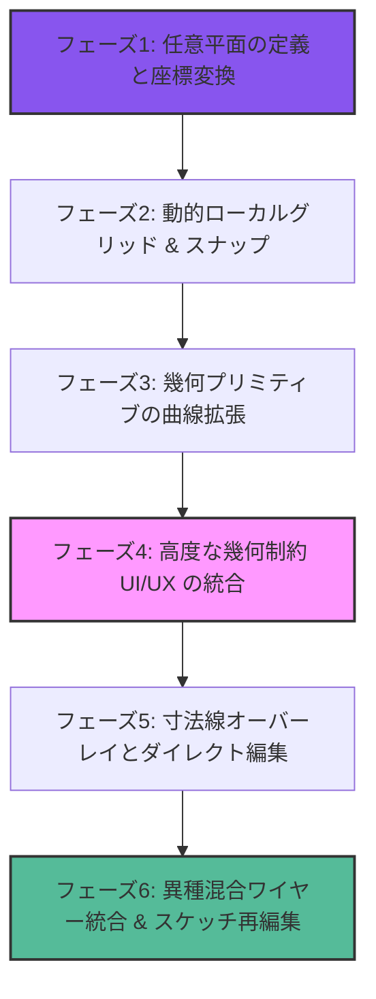

<!-- DOC-STATUS -->
> **状態: ほぼ達成済み・設計意図の記録として保存** — フェーズ1〜6 のうち、任意平面・スナップ・曲線プリミティブ・拘束 UI・スケッチ再編集は**実装済み**。拘束の不足も 8.1.5.6 で解消した（`FEATURE_GAPS.md` §2）。
> **未達で残っているのはフェーズ 5.1（引出線と矢印を伴う寸法線の作図）と 4.2（拘束バッジの描画）だけ。** 現在は数値ラベルのみ。
>
> 全体の分類は `CLAUDE.md` §6 にある。**このバナーを消さないこと。**

---

# 2D CAD スケッチャーへの昇華：段階的実装ロードマップ

本ドキュメントは、Seamless CADの2Dスケッチ環境を「単なる線の繋ぎ合わせ」から、商用CAD（Fusion360やSolidWorksなど）に匹敵する **「完全寸法駆動・幾何拘束型の2D CADエンジン」** へと引き上げるための具体的なフェーズ設計と開発ワークフローです。

---

## 🗺️ 開発ロードマップ概要

---

## 🛠️ 各フェーズの詳細設計・タスク

### 【フェーズ 1】任意平面の定義と座標変換（アフィン空間の確立）
3D空間の任意の場所にスケッチを描くための、数学的な座標架け橋を構築します。

*   **1.1 平面選択オペレータの作成:**
    *   3Dビューポート上のソリッドの面（Face）、または既存の作業平面をクリックして選択。
    *   選択された面の中心点を「原点 (Origin)」、法線ベクトルを「Z軸 (Normal)」として取得。
*   **1.2 ローカル-グローバル座標系マトリクス算出:**
    *   法線ベクトルに直交する2つのベクトル（$U$軸, $V$軸）を算出し、ローカル2Dとグローバル3Dを相互変換するアフィン変換マトリクス（`mathutils.Matrix`）を動的に生成。
*   **1.3 3Dレイキャスト投影:**
    *   3Dビューポート上でのマウスの視線光線（Ray）と、定義したローカル平面の交点を数学的に算出し、ローカルの $u, v$ 座標へ変換。

---

### 【フェーズ 2】動的ローカルグリッド ＆ スナップ（作図の正確性）
任意の傾いた面の上にグリッドを綺麗に描画し、正確な描画を可能にします。

*   **2.1 WGPU/OpenGL ローカルグリッドの描画:**
    *   3D空間内で、選択したローカル平面上にグリッドラインをオーバーレイ描画。
    *   ユーザーのズーム度合い（カメラ距離）に応じて、グリッド幅を自動スロットリング（10mm ➡ 1mm ➡ 0.1mmなど）。
*   **2.2 精密スナップ（グリッド ＆ 幾何学）:**
    *   マウス位置 $u, v$ をグリッド単位に吸着（スナップ）。
    *   既存の3Dモデルのエッジや頂点、スケッチ内の他の要素（端点、中点、円の中心）への吸着機能を実装。

---

### 【フェーズ 3】幾何プリミティブの曲線拡張（直線から円・円弧へ）
直線のみのトポロジーから、曲線を含んだ機械部品設計への表現力を拡張します。

*   **3.1 曲線プリミティブの追加:**
    *   **円 (Circle) ツール:** 中心点と半径で円を描画。
    *   **3点円弧 (3-Point Arc) / 接線円弧 (Tangent Arc) ツール:** 2つの端点と膨らみ具合（または先行する直線から滑らかに繋がるアーク）を描画。
*   **3.2 EZPZ 幾何変数へのマッピング:**
    *   追加した円や円弧の中心点、半径のサイズを EZPZ の変数として登録。

---

### 【フェーズ 4】高度な幾何制約（GCS）UI/UX の統合（接線・平行・直交）
EZPZソルバーの幾何計算能力を最大限に引き出すための、直感的な制約付与UI。

*   **4.1 ショートカットによるスマート拘束追加:**
    *   `[T]` ➡ 直線と円（円弧）を滑らかに接合 (Tangent)
    *   `[P]` ➡ 2本の線を平行にする (Parallel)
    *   `[L]` ➡ 2本の線の長さを等しくする (Equal Length)
    *   `[M]` ➡ 点を線の中央に合わせる (Midpoint)
*   **4.2 ビジュアル拘束バッジ（アイコン）の描画:**
    *   どのエッジに「接線」や「平行」などの拘束がかかっているかを、ビューポート上に小さな記号（バッジ）としてリアルタイム描画。

---

### 【フェーズ 5】寸法線オーバーレイとダイレクト編集（CAD製図の実現）
寸法を視覚的に管理し、その場で数字を入力して形状を伸縮させるCADの顔となる機能。

*   **5.1 寸法線（Dimension Line）の描画:**
    *   2つの点、または線の隣に、引き出し線と矢印、現在の数値（例：`20.0`）をCAD図面のように美しく描画。
*   **5.2 フローティング数値入力ダイアログ:**
    *   寸法線の数値をダブルクリック（または選択して数値キー入力）した際に、その場で値を書き換える入力BOXを表示。
*   **5.3 ソルバー再計算と追従:**
    *   変更された数値を EZPZ ソルバーに送り、全体の形状を追従変形させてビューポートを更新。

---

### 【フェーズ 6】異種混合ワイヤー統合 ＆ スケッチ再編集（履歴モデリング）
直線・曲線の交ざったスケッチから面を張り、いつでも過去のスケッチに戻って修正できる非破壊履歴の確立。

*   **6.1 `BRepBuilderAPI_MakeWire` によるトポロジー統合:**
    *   直線、円弧、スプラインなどの異なる幾何エッジを一本の閉じた「ワイヤー」にOpenCascade側で統合し、面（Face）を構築。
*   **6.2 非破壊「Edit Sketch（スケッチ再編集）」履歴の構築:**
    *   ソリッドモデルを選択して「Edit Sketch」を押した際、モデルを一時的に非表示にし、元の2Dスケッチデータ（点・線・拘束）を復元してスケッチモードを再開。再確定時に、3Dソリッドを再計算・更新するループの完成。

---

## 🔍 幾何拘束・作図コマンドの実装容易性＆確実性分析 (2026-05-19 追記)

現在のRust側GCSソルバー（EZPZ連携）およびアドオン構造を調査した結果に基づき、実装の「確実さ」「難易度（実装しやすさ）」「優先度」を再整理しました。

### 📊 実装優先度・難易度一覧

| 優先度 | 機能・コマンド名 | 実装の容易さ | 実装確実さ | 現状と実装のアプローチ |
| :---: | :--- | :---: | :---: | :--- |
| **1** | **距離/長さ指定拘束 (Distance)** | ★★★★★ | ★★★★★ | **【即実装可能 / 最優先】** Rust側の `solve_sketch` にすでに `DISTANCE` 判定と `Constraint::Distance` が実装済み。PythonのUIとデータ受け渡しを実装するだけで即座に動作するため、極めて低リスクかつ確実。 |
| **2** | **直交 (Perpendicular) / 平行 (Parallel)** | ★★★★☆ | ★★★★☆ | **【Rust側の微修正が必要】** EZPZには既に拘束関数が存在するため、Rustの `solve_sketch` に判定分岐を数行追加し、Python UIを追加するだけで安定動作。 |
| **3** | **一致拘束 (Coincident)** | ★★★☆☆ | ★★★★☆ | **【トポロジー設計が必要】** 点Aと点Bを物理的に同一の頂点IDに「統合」するか、別々のIDのまま「GCSソルバーで位置を重ね合わせる」かの設計選択が必要。 |
| **4** | **トリム / フィレット / オフセット** | ★★☆☆☆ | ★★★☆☆ | **【高難易度 / 要計算ロジック】** 幾何交差計算や、スケッチトポロジー（頂点の分割、エッジの追加削除）をPython側で動的に再構築する必要があり、工数が大きい。 |

### 🚀 直近の推奨ステップ
1. **フェーズ5（寸法）の先取りとしての「Distance (距離/長さ) 拘束」のUI実装**
   * 2つの頂点、または1つの辺を選択した際に、サイドバーに現在の距離の数値入力スライダーを表示。
   * 数値変更時に `solve_gcs_external` へ `DISTANCE` 拘束として値を渡し、ソルバーの計算結果をリアルタイムで反映。
   * これにより、「長さを指定して設計する」というCADの本質的な機能が最も早く・確実に手に入ります。
