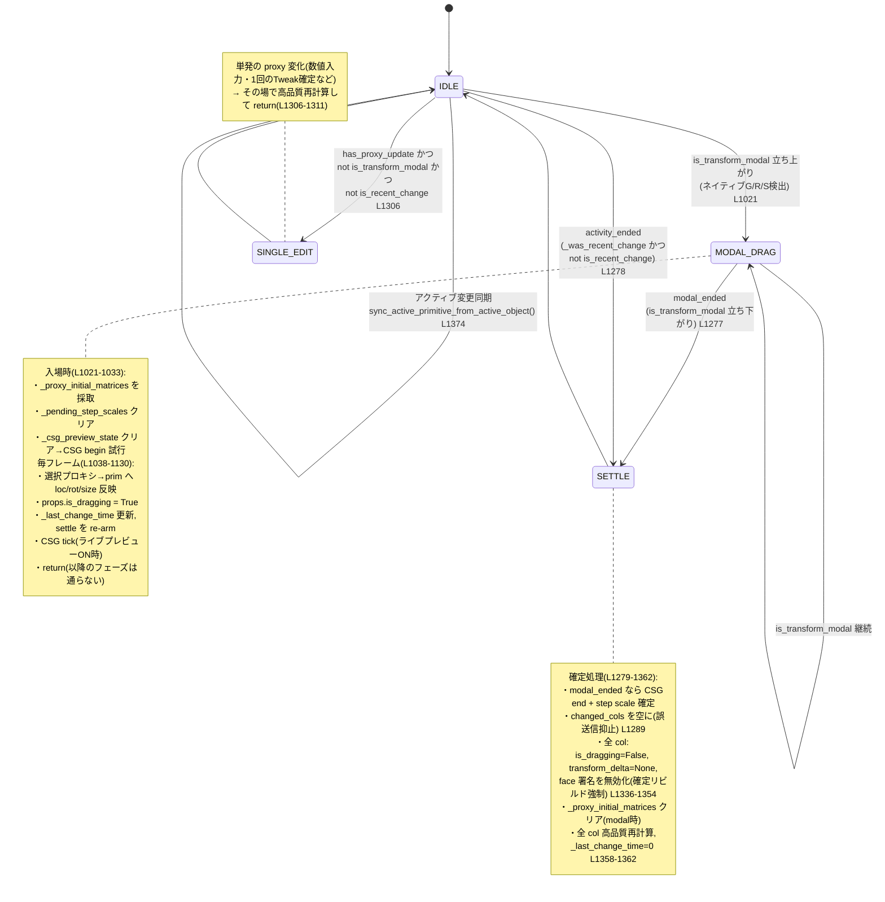

# depsgraph_update_handler 状態機械マップ

> 目的: `utils.depsgraph_update_handler` を中心とする「ドラッグ/変形 → 確定」の状態遷移を
> 外部化し、**バグを見つけやすくする**ための地図。コードは変更していない。
> 参照はすべて `CAD_8_1_5_1/utils.py` の行番号(**2026-07-19 時点**)。
>
> ⚠️ **§1〜§3 の行番号はもう当てにならない。** 2026-07-28 のフェーズ抽出(§6-2)で
> handler は 420行 → 155行になり、#5/#6/#9 の中身はそれぞれ
> `_handle_modal_drag()` / `_handle_nonmodal_sync()` / `_handle_settle()` へ移動した。
> **フラグの意味・状態遷移・フェーズの順序は変わっていない**ので、地図としては引き続き有効。
> 行番号ではなく関数名で探すこと。§4 は 2026-07-28 時点の行番号。

---

## 1. 登場するフラグ(状態変数)

| 名前 | 種別 | 置き場所 | 意味 | 主な書き込み | 主な読み取り |
|---|---|---|---|---|---|
| `_is_updating_proxies` | module global | utils | 「今スクリプトがプロキシ/プロパティを書き換え中」= depsgraph/preview の再入抑止 | sync_proxies, 各同期ブロック, `sync_active_primitive_from_active_object` | handler 冒頭 `L960`, preview `core_bridge L1276` |
| `_was_transform_modal` | module global | utils | 前フレームが「ネイティブ変形モーダル中」だったか | `L1001,1131,1312,1373`, settle `L947` | modal_ended 判定 `L1277` |
| `_was_recent_change` | module global | utils | 前フレームが「直近変化(<0.3s)」だったか | `L1132,1313,1374`, settle `L948` | activity_ended 判定 `L1278` |
| `_last_change_time` | module global | utils | 最後にプロキシ変化を検知した時刻 | `L1124,1304`, 確定/settleで0 `L1362,1365,1371,949` | is_recent_change 算出 `L1005` |
| `_proxy_initial_matrices` | module global | utils | ドラッグ開始時の各プロキシの world 行列(delta 計算の基準) | modal開始 `L1028`, clear `L1022,1025,1356,950` | delta 計算 `L1103`, CSG begin `L803` |
| `_csg_preview_state` | module global | utils | ライブ BSP CSG プレビューの作動状態(col単位) | begin `L809`, clear `L1030,906` | tick/preview 抑止 `L1123,core_bridge L1295` |
| `props.is_dragging` | per-collection | properties | 「このコレクションはドラッグ中」= 結果ワイヤー簡略描画・fast preview 許可 | `L1085,1095,1147`, 下ろす `L1340,1343,930` | fast preview ゲート `L1319`, core_bridge `L1061` |

### 派生値(そのフレーム内のローカル)

- `is_transform_modal = active_op_looks_transform and has_proxy_update` … `L992`
  - `active_op_looks_transform`: `active_operator.bl_idname` に TRANSFORM_OT/GIZMO/MOVE/ROTATE/SCALE/RESIZE/TWEAK を含む `L971`
  - `has_proxy_update`: `depsgraph.updates` にプロキシ or ライブCADコレクションの更新がある `L977-986`
- `modal_state_changed = (is_transform_modal != _was_transform_modal)` … `L993`
- `is_recent_change = (now - _last_change_time) < 0.3` … `L1005`
- `is_fast_mode = is_transform_modal or is_recent_change` … `L1006`
- `modal_ended = _was_transform_modal and not is_transform_modal` … `L1277`
- `activity_ended = _was_recent_change and not is_recent_change and not is_transform_modal` … `L1278`

---

## 2. ライフサイクル(状態遷移図)

### 保険: ワンショット・セトルタイマー `_arm_drag_settle` (`L910`)
ネイティブ変形の取りこぼしで `modal_ended` が来ないケースに備え、ドラッグ検知のたびに
0.28s のワンショットタイマーを re-arm。最新トークンだけが発火し、`is_dragging=False`・
`transform_delta=None`・高品質再計算・`_proxy_initial_matrices.clear()` を行って IDLE に戻す。

---

## 3. handler 本体のフェーズ(上から順)

| # | 行 | フェーズ | やること | 抜ける？ |
|---|---|---|---|---|
| 0 | L960 | 再入ガード | `_is_updating_proxies` なら即 return | ✔ return |
| 1 | L964-992 | 変形判定 | active_operator と depsgraph.updates から `is_transform_modal` を確定 | |
| 2 | L997 | 無関係更新の早期リターン | CAD に無関係な更新なら return | ✔ return |
| 3 | L1009-1015 | 対象 col 選定 | touched_col_names or 全登録 col | |
| 4 | L1021-1033 | モーダル入場 | 初期行列採取・CSG begin | |
| 5 | L1038-1130 | **モーダル変形フェーズ** | proxy→prim 反映・delta 送信・CSG tick → **return** | ✔ return |
| 6 | L1136-1272 | **非モーダル同期フェーズ** | (A)削除同期 / (B)proxy→prim 反映 | |
| 7 | L1277-1290 | 終了判定 | modal_ended / activity_ended、changed_cols 抑止 | |
| 8 | L1292-1331 | 高速プレビュー発行 | ドラッグ中のみ fast preview / settle re-arm | |
| 9 | L1336-1362 | **確定フェーズ** | is_dragging 解除・delta 解除・高品質再計算 | |
| 10 | L1373-1374 | アクティブ同期 | `sync_active_primitive_from_active_object()` | |

---

## 4. ⚠️ 検証が必要な箇所(コメントとコードのズレ / 要注意点)

### 4-1. `props.is_dragging` の代入がコメントと食い違う ✅ 解決済(2026-07-28)
**結論: コードが正・コメントが古い残骸だった。コメント側を実態に合わせた。**

当時のコメント(`L1141-1147`)は「is_recent_change かつ has_proxy_update もドラッグとみなす」と
書いていたが、コードは `props.is_dragging = is_transform_modal` のみだった。

判断の決め手は**すぐ上 `L996-999` の英語コメント**。active_operator が Move/Resize の redo パネル
表示中も立ちっぱなしになる問題への後付け修正で、そこにこう記録されている:

> そうしないと **is_dragging が latch したままになり、WGPU Overlay OFF 時に Python
> ワイヤーフレームが消える**。

つまり「is_dragging を過剰に立てると描画が消える」実機バグを踏んで、**絞り込む方向**の修正が
入っている。マップが推測した `is_transform_modal or (is_recent_change and has_proxy_update)` は
まさにその過剰 latch 側に戻す変更であり、採用すべきでない。§5 の H はこの件そのもの。

→ 現在のコメント(`L1149-1152`)は「is_recent_change は意図的に含めない」旨と、広げる方向の
変更には H の回帰確認が必須である旨を明記している。

### 4-2. `0 <= p_idx` の None ガード欠落(潜在エラー) ✅ 対処済(2026-07-28)
`p_idx = obj.get("primitive_index")` が `None` だと `0 <= None` で `TypeError`。
`L1066` を `if p_uuid and p_idx is not None and 0 <= p_idx < len(props.primitives):` に修正。

### 4-3. 早期リターンで `_was_recent_change` を更新しない
`L997` の早期 return は `_was_transform_modal` のみ更新し `_was_recent_change` は据え置き。
`_arm_drag_settle` タイマーが保険で拾う設計のため実害は小さいが、activity_ended の判定が
1フレームずれる可能性がある。

### 4-4. `set_active_primitive` の多重 preview ✅ 対処済(2026-07-30)
実際は**2回ではなく3回**だった。`operators/management.py` の index 代入が
`update_gizmo_callback` を誘発し、その中の `selected_edges_str` / `selected_faces_str` への
代入が**それぞれ** `update_cad_preview` を発火(`properties.py L557,558`)、さらに末尾で
明示的に1回。Feature Tree のクリック1回につき再計算3回。

**修正**: ビューポート側の経路(`utils.sync_active_primitive_from_active_object` の
`L1444-1446`)は既に `_is_updating_proxies` で同じ抑止をしていたので、Feature Tree 側を
それに揃えた(index 代入を try/finally でガード)。`core_bridge` の
`if is_syncing and not force: return`(`L1433`)が余計な2回を弾き、確定した状態で
明示的な1回だけが走る。ハイライトは `selected_edges_str` 確定後に計算されるので
むしろ正確になる(§5 G と関連)。

---

## 5. 回帰チェックリスト(手動セーフティネット)

> 自動テスト整備前の当面の安全網。改修のたびにこの数分の手順を通す。
> 各項目の「期待」が崩れたら、その改修が原因。

- [ ] **A. アクティブ同期(今回の変更)**: ビューポート/アウトライナーでプロキシをクリック
  → Feature Tree の Selection の ● (RADIOBUT_ON) が即座に該当行へ移動する。
- [ ] **B. Feature Tree→ビューポート**: Feature Tree の行をクリック
  → 対応するプロキシがアクティブ&選択される。●も一致。
- [ ] **C. ドラッグ追従**: プロキシを G で移動 → 結果形状がリアルタイムに追従。
  離すと高品質結果に確定(辺が細い簡略描画のまま残らない)。
- [ ] **D. ドラッグ確定後のフラグ解除**: C の直後、何もせず数秒待つ
  → 再描画が固まらない/`is_dragging` が残らない(次のクリックが普通に効く)。
- [ ] **E. 数値入力(単発編集)**: Active Property Editor で loc/size を直接入力
  → その場で1回だけ高品質再計算(ドラッグ扱いにならない)。
- [ ] **F. プリミティブ削除**: プロキシを Delete
  → Feature Tree から該当行が消え、active index が範囲内に収まる。
- [ ] **G. FILLET/CHAMFER 選択ハイライト**: FILLET モディファイア行を(B とビューポート A の両方で)
  選択 → 選択エッジのハイライトが表示される(★4-1 と関連: 両経路で同じ見え方か確認)。
- [ ] **H. WGPU Overlay OFF**: プリファレンスで OFF にして C を実行
  → 確定後に辺が消えない(空の高速プレビューで上書きされない)。
- [ ] **I. Undo/Redo**: いくつか操作して Ctrl+Z / Ctrl+Shift+Z
  → プロパティ・C++コア・描画が一致した状態に戻る。

---

## 6. 次の一歩(このマップの使い道)

1. ~~**★4-1 の判断**~~ → **完了(2026-07-28)**。コード側が正と判断しコメントを修正。§4-1 参照。
   併せて 4-2 の None ガードも対処済み。
2. ~~**②局所分解**~~ → **完了(2026-07-28)**。#5/#6/#9 を挙動を変えずに
   `_handle_modal_drag()`(`e69da15`) / `_handle_nonmodal_sync()`(`4d0b892`) /
   `_handle_settle()`(`cd059c6`) へ抽出。handler は 420行 → **155行**。
   各抽出は「差分の追加行/削除行を正規化して突き合わせ、消えた行がゼロであること」で
   純粋な移動であることを機械的に検証している。**§5 の C/D/H は実機未確認**。
3. **①自動化**: `blender --background --python` で駆動できる回帰テストに §5 を落とし込む
   (Blender 実行環境が必要なため、ここでは雛形のみ別途相談)。
