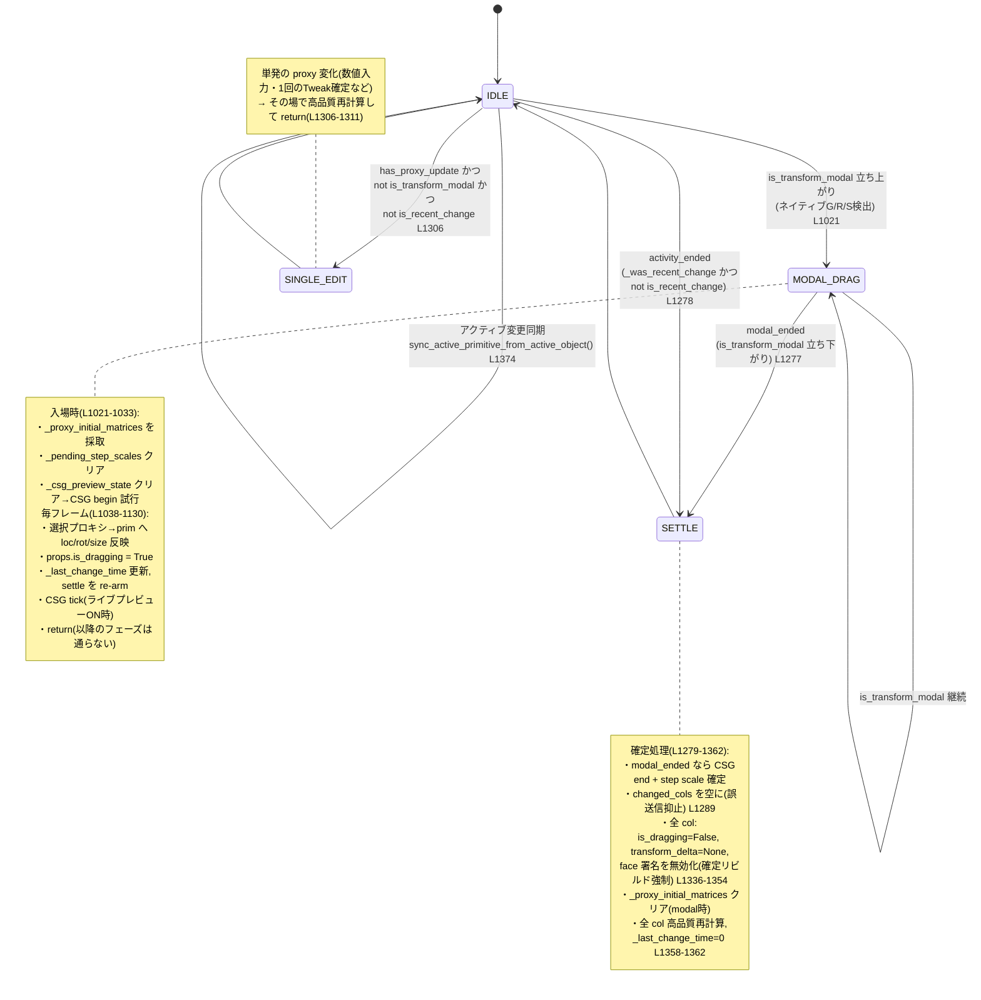

# depsgraph_update_handler 状態機械マップ

> 目的: `utils.depsgraph_update_handler` を中心とする「ドラッグ/変形 → 確定」の状態遷移を
> 外部化し、**バグを見つけやすくする**ための地図。コードは変更していない。
> 参照はすべて `CAD_8_1_5_1/utils.py` の行番号(**2026-07-19 時点**)。
>
> ⚠️ **§1〜§3 の行番号はもう当てにならない。** 2026-07-28 のフェーズ抽出(§6-2)で
> handler は 420行 → 155行になり、#5/#6/#9 の中身はそれぞれ
> `_handle_modal_drag()` / `_handle_nonmodal_sync()` / `_handle_settle()` へ移動した。
> **フラグの意味・状態遷移・フェーズの順序は変わっていない**ので、地図としては引き続き有効。
> 行番号ではなく関数名で探すこと。§4 は 2026-07-28 時点の行番号。

---

## 1. 登場するフラグ(状態変数)

| 名前 | 種別 | 置き場所 | 意味 | 主な書き込み | 主な読み取り |
|---|---|---|---|---|---|
| `_is_updating_proxies` | module global | utils | 「今スクリプトがプロキシ/プロパティを書き換え中」= depsgraph/preview の再入抑止 | sync_proxies, 各同期ブロック, `sync_active_primitive_from_active_object` | handler 冒頭 `L960`, preview `core_bridge L1276` |
| `_was_transform_modal` | module global | utils | 前フレームが「ネイティブ変形モーダル中」だったか | `L1001,1131,1312,1373`, settle `L947` | modal_ended 判定 `L1277` |
| `_was_recent_change` | module global | utils | 前フレームが「直近変化(<0.3s)」だったか | `L1132,1313,1374`, settle `L948` | activity_ended 判定 `L1278` |
| `_last_change_time` | module global | utils | 最後にプロキシ変化を検知した時刻 | `L1124,1304`, 確定/settleで0 `L1362,1365,1371,949` | is_recent_change 算出 `L1005` |
| `_proxy_initial_matrices` | module global | utils | ドラッグ開始時の各プロキシの world 行列(delta 計算の基準) | modal開始 `L1028`, clear `L1022,1025,1356,950` | delta 計算 `L1103`, CSG begin `L803` |
| `_csg_preview_state` | module global | utils | ライブ BSP CSG プレビューの作動状態(col単位) | begin `L809`, clear `L1030,906` | tick/preview 抑止 `L1123,core_bridge L1295` |
| `props.is_dragging` | per-collection | properties | 「このコレクションはドラッグ中」= 結果ワイヤー簡略描画・fast preview 許可 | `L1085,1095,1147`, 下ろす `L1340,1343,930` | fast preview ゲート `L1319`, core_bridge `L1061` |

### 派生値(そのフレーム内のローカル)

- `is_transform_modal = active_op_looks_transform and has_proxy_update` … `L992`
  - `active_op_looks_transform`: `active_operator.bl_idname` に TRANSFORM_OT/GIZMO/MOVE/ROTATE/SCALE/RESIZE/TWEAK を含む `L971`
  - `has_proxy_update`: `depsgraph.updates` にプロキシ or ライブCADコレクションの更新がある `L977-986`
- `modal_state_changed = (is_transform_modal != _was_transform_modal)` … `L993`
- `is_recent_change = (now - _last_change_time) < 0.3` … `L1005`
- `is_fast_mode = is_transform_modal or is_recent_change` … `L1006`
- `modal_ended = _was_transform_modal and not is_transform_modal` … `L1277`
- `activity_ended = _was_recent_change and not is_recent_change and not is_transform_modal` … `L1278`

---

## 2. ライフサイクル(状態遷移図)



### 保険: ワンショット・セトルタイマー `_arm_drag_settle` (`L910`)
ネイティブ変形の取りこぼしで `modal_ended` が来ないケースに備え、ドラッグ検知のたびに
0.28s のワンショットタイマーを re-arm。最新トークンだけが発火し、`is_dragging=False`・
`transform_delta=None`・高品質再計算・`_proxy_initial_matrices.clear()` を行って IDLE に戻す。

---

## 3. handler 本体のフェーズ(上から順)

| # | 行 | フェーズ | やること | 抜ける？ |
|---|---|---|---|---|
| 0 | L960 | 再入ガード | `_is_updating_proxies` なら即 return | ✔ return |
| 1 | L964-992 | 変形判定 | active_operator と depsgraph.updates から `is_transform_modal` を確定 | |
| 2 | L997 | 無関係更新の早期リターン | CAD に無関係な更新なら return | ✔ return |
| 3 | L1009-1015 | 対象 col 選定 | touched_col_names or 全登録 col | |
| 4 | L1021-1033 | モーダル入場 | 初期行列採取・CSG begin | |
| 5 | L1038-1130 | **モーダル変形フェーズ** | proxy→prim 反映・delta 送信・CSG tick → **return** | ✔ return |
| 6 | L1136-1272 | **非モーダル同期フェーズ** | (A)削除同期 / (B)proxy→prim 反映 | |
| 7 | L1277-1290 | 終了判定 | modal_ended / activity_ended、changed_cols 抑止 | |
| 8 | L1292-1331 | 高速プレビュー発行 | ドラッグ中のみ fast preview / settle re-arm | |
| 9 | L1336-1362 | **確定フェーズ** | is_dragging 解除・delta 解除・高品質再計算 | |
| 10 | L1373-1374 | アクティブ同期 | `sync_active_primitive_from_active_object()` | |

---

## 4. ⚠️ 検証が必要な箇所(コメントとコードのズレ / 要注意点)

### 4-1. `props.is_dragging` の代入がコメントと食い違う ✅ 解決済(2026-07-28)
**結論: コードが正・コメントが古い残骸だった。コメント側を実態に合わせた。**

当時のコメント(`L1141-1147`)は「is_recent_change かつ has_proxy_update もドラッグとみなす」と
書いていたが、コードは `props.is_dragging = is_transform_modal` のみだった。

判断の決め手は**すぐ上 `L996-999` の英語コメント**。active_operator が Move/Resize の redo パネル
表示中も立ちっぱなしになる問題への後付け修正で、そこにこう記録されている:

> そうしないと **is_dragging が latch したままになり、WGPU Overlay OFF 時に Python
> ワイヤーフレームが消える**。

つまり「is_dragging を過剰に立てると描画が消える」実機バグを踏んで、**絞り込む方向**の修正が
入っている。マップが推測した `is_transform_modal or (is_recent_change and has_proxy_update)` は
まさにその過剰 latch 側に戻す変更であり、採用すべきでない。§5 の H はこの件そのもの。

→ 現在のコメント(`L1149-1152`)は「is_recent_change は意図的に含めない」旨と、広げる方向の
変更には H の回帰確認が必須である旨を明記している。

### 4-2. `0 <= p_idx` の None ガード欠落(潜在エラー) ✅ 対処済(2026-07-28)
`p_idx = obj.get("primitive_index")` が `None` だと `0 <= None` で `TypeError`。
`L1066` を `if p_uuid and p_idx is not None and 0 <= p_idx < len(props.primitives):` に修正。

### 4-3. 早期リターンで `_was_recent_change` を更新しない
`L997` の早期 return は `_was_transform_modal` のみ更新し `_was_recent_change` は据え置き。
`_arm_drag_settle` タイマーが保険で拾う設計のため実害は小さいが、activity_ended の判定が
1フレームずれる可能性がある。

### 4-4. `set_active_primitive` の多重 preview ✅ 対処済(2026-07-30)
実際は**2回ではなく3回**だった。`operators/management.py` の index 代入が
`update_gizmo_callback` を誘発し、その中の `selected_edges_str` / `selected_faces_str` への
代入が**それぞれ** `update_cad_preview` を発火(`properties.py L557,558`)、さらに末尾で
明示的に1回。Feature Tree のクリック1回につき再計算3回。

**修正**: ビューポート側の経路(`utils.sync_active_primitive_from_active_object` の
`L1444-1446`)は既に `_is_updating_proxies` で同じ抑止をしていたので、Feature Tree 側を
それに揃えた(index 代入を try/finally でガード)。`core_bridge` の
`if is_syncing and not force: return`(`L1433`)が余計な2回を弾き、確定した状態で
明示的な1回だけが走る。ハイライトは `selected_edges_str` 確定後に計算されるので
むしろ正確になる(§5 G と関連)。

### 4-5. 保存した .blend を開き直すと CAD が死ぬ ✅ 修正済(2026-07-30)
**症状(実測)**: 保存したファイルを開くと、Feature Tree・プロキシ・UI 状態は復元されるが、
**モデルが描画されず、プロキシをドラッグしても何も起きない**。パネルを一度触ると形状は
戻るが、ドラッグは Blender を再起動するまで死んだまま。

**原因は独立した2つ**で、片方だけ直しても回復しないことを実験で確認した:

1. `utils.depsgraph_update_handler` に `@persistent` が無く、Blender が
   **ファイル読み込み時に非 persistent なハンドラを破棄する**ため外れる。
   `load_post_handler` など他の3つには付いていたので付け忘れ。
2. `load_post_handler` が `safe_delete_stack` で stack_ptr を 0 に潰すが、誰も作り直さない。
   `_is_live_cad_collection` が False になるので、ハンドラが戻っていても
   そのコレクションは対象外として無視される。

**修正**: (1) `utils.py` の handler に `@persistent`。(2) `load_post_handler` が
「潰す前に stack_ptr != 0 だったコレクション名」を控え、`_schedule_cad_resume()` で
スタック再生成 → `_register_cad_collection` → 高品質プレビュー1回、を行う。
プレビューは毎回フル履歴(`binary_payload`)を送る作りなので、スタックさえ作り直せば
保存された Feature Tree から完全に復元できる。差分復元は不要だった。

再計算は 0.1s のタイマーへ逃がしてある。ファイルを開く処理の中で全パートを OCC
再計算すると重いモデルで open が固まるため。「ファイルは軽く開き、ワンテンポ後に
モデルが現れる」形。背景実行ではタイマーが回らないので即座に走らせる。

回帰テスト `save + reload keeps CAD live` で固定済み。2つの原因それぞれを個別に
潰す破壊テストを行い、対応する断言だけが落ちることを確認した。

### 4-6. Undo が1回目に効かない / 背景実行では落ちる ✅ 修正済(2026-07-30)
**症状(実測)**: Ctrl+Z 相当を1回呼んでも**何も戻らず**、2回目でようやく1つ戻る。
背景実行では回帰スイートが `EXCEPTION_ACCESS_VIOLATION` で死ぬ(終了コード 11)。

| | Undo 1回目 | Undo 2回目 |
|---|---|---|
| 修正前 | **変化なし**(prim も proxy もそのまま) | BOX に戻る |
| ハンドラを外した場合 | BOX に戻る(正しい) | それ以上戻らない |

**原因**: `undo_redo_post_handler` が `undo_post` の中で `sync_proxies` と
高品質再計算を行い、**データを書き換えていた**。undo_post での書き換えはそれ自体が
新しい undo ステップになるため、次の Ctrl+Z がそこへ戻ってしまう。Blender で
undo_post 内のデータ変更が禁じ手とされる理由そのもの。

**修正**: 書き換えを伴う再同期を `_resync_after_undo()` に切り出し、
`bpy.app.timers.register(..., first_interval=0.0)` で **undo が完全に終わってから**
走らせる。ハンドラ本体が直接触るのは、undo スタックに載らない描画エンジンの
状態(`hidden_primitive_uuids.clear()`)だけにした。

回帰テスト `one undo = one step` で固定済み。**破壊テスト(再同期を undo_post に
戻す)ではスイートがクラッシュ(終了コード11)し、修正版では 14件パスする**ことを確認。

⚠️ 残る注意点:
- 背景実行では `ed.undo` の poll が最初 False で、`ed.undo_push` を**3回**入れないと
  通らない。**poll が False のまま `ed.undo()` を呼ぶと Blender ごと落ちる**ので、
  テストでは必ず poll を確認してから呼ぶこと。
- Blender 4.x の背景実行では、poll を確認しても `ed.undo()` で落ちる(4.2.7 で確認、
  5.1.1 では落ちない)。回帰テストは 5.0 未満で SKIP する。
  **GUI の 4.2 では、利用者が軽く試した範囲でクラッシュしないことを確認済み
  (2026-08-01)。** 網羅的な確認ではないが、背景実行特有の現象という見立てを支持する。
- 背景実行ではタイマーが回らないため、**再同期そのものは走っていない**。テストが
  保証するのは「undo_post がもうデータを書かない」ことまで。**GUI で Ctrl+Z 後に
  ビューポートが正しく更新されるかは実機確認が必要。**

### 4-7. CYLINDER / SPHERE の `radius` が効かないのに UI に出る ★要判断(2026-08-01 発見)
出品前調査で判明。**プロパティ欄に「Radius」が表示されるが、形状に一切影響しない。**

| | radius=0.25 | radius=1.0 | radius=2.0 | size=(0.3,0.3,1.0) |
|---|---|---|---|---|
| CYLINDER の X 範囲 | -1.00〜1.00 | -1.00〜1.00 | -1.00〜1.00 | **-0.30〜0.30** |
| SPHERE の X 範囲 | -1.00〜1.00 | -1.00〜1.00 | -1.00〜1.00 | **-0.30〜0.30** |

カーネル側が `radius` を読んでいない(`src_rust/src/occ_primitives.cpp`):

```cpp
prim = BRepPrimAPI_MakeCylinder(gp_Ax2(gp_Pnt(0,0,-sz/2), gp_Dir(0,0,1)), sx, sz).Shape();
prim = BRepPrimAPI_MakeSphere(sx).Shape();
```

半径は **`size.x`**。`radius` は SLOT 等の一部の型では使われているが、この2型では読まれない。
それでも `ui/ui_main_panel.py` の `elif active_prim.type not in {...}` の除外リストに
CYLINDER / SPHERE が入っていないため、`size` と `radius` の両方が描画される。

**修正(UI 側を採用)**: この分岐で `radius` を描くのは `ARC` のときだけにした。
カーネルで `radii[i]` を読む型を全部洗った結果、この分岐に入るもののうち該当するのは
ARC のみ(`make_arc(radii[i], ...)`)。CONE/TORUS/SLOT/POLYGON/HELIX/VARIABLE_BOX と
各モディファイアは元から別分岐で、それぞれ専用 UI を持つので影響しない。
カーネル側を直す案は採らなかった: 既存ファイルの円柱・球の見た目が変わる恐れがあり、
大きさは `size` で変えるという現状の操作系で一貫しているため。

確認: プロパティ欄に出る項目を型ごとに機械的に列挙し、BOX/CYLINDER/SPHERE から
radius が消え、ARC と CONE には残ることを確認済み。

なお、この調査の途中で「ブーリアン減算が空を返す」と誤検知した。原因は
radius が効かないことに気づかず既定サイズのシリンダーがボックスを飲み込んでいたため。
**SUB/ADD/INT はいずれも正常**(貫通穴 188 頂点 / 部分欠け 138 / 非接触 8)。

### 4-8. UI に出ているのに形状へ効かないパラメータ(2026-08-01 監査)
`audit_ui_params.py` で全プリミティブについて「UI に出ている項目」と
「実際に形状を変える項目」を突き合わせた。判定は値を変えて **force=True で**
再計算し、頂点数と bounding box が動くかどうか(force を付けないと
core_bridge の「前回と同内容ならスキップ」に阻まれて全部『効かない』に見える)。

**UI 側を直したもの** — 効かない成分を出さないようにした:

| 型 | 直した内容 | 根拠 |
|---|---|---|
| CYLINDER / SPHERE | `radius` を出さない | `make_cylinder(sx,sy,sz)` / `make_sphere(sx,sy,sz)` |
| SLOT | `size` を X 成分のみ | `make_slot(radii[i], sx)` |
| CONE | `size` を Z 成分のみ | `make_cone(radii[i], radii2[i], sz)` |

**根本原因(2026-08-01 に解明)**: 残っていた HELIX / VARIABLE_BOX は UI の問題ではなく、
**汎用押し出しが型で絞られていなかった**ことが原因だった。§4-10 を参照。

ARC の `angle_start` は**監査ツールの誤検知**だった。既定 0 に対し「2倍+0.3」で
0.3度しか振っておらず、形は変わっても bounding box が同じで「効かない」と出ていた。
角度は +60 度振るよう修正済み。実測では 45度で X 最大が 1.10→0.78、90度で 0.00 と
正しく効いている。ARC の `size` は本当に死んでいた(`make_arc` は radius しか読まない)
ので UI から外した。

**現在は全 11 型で不一致ゼロ**(`audit_ui_params.py` の終了コード 0)。

**監査ツールの限界**: bounding box と頂点数でしか見ていないので、
「形は変わるが外形寸法は同じ」変化は原理的に取りこぼす。振り幅が小さいと
上記 ARC のような誤検知が出る。**「効かない」と出たら、まず振り幅を疑うこと。**

### 4-9. 配布物の減量(2026-08-01)
ZIP が 140.8MB あり、中身の大半が OCCT の bin フォルダ丸ごとコピーだった。
**推測で消さず、1グループずつ退避して回帰テストで確かめた**(結果は意外だった)。

| 対象 | サイズ | 判定 |
|---|---|---|
| **Qt5\*.dll (66個)** | 111 MB | **不要** → 外した |
| **libs/numpy (+ numpy.libs)** | 45 MB | **不要** → 外した |
| FFmpeg (av*/swscale/swresample/postproc, 6個) | 23 MB | **必要**。外すとカーネルが起動しない |
| TK\*.dll (84個) | 62 MB | 必要(OpenCASCADE 本体) |

FFmpeg が必要なのは意外だった。「動画コーデックが CAD に要るわけがない」と思って
Qt5 と一緒に外したら、カーネルが一切応答しなくなった。cad_server.exe のロード時
依存に入っている(OCCT のビルド構成由来)。**推測で消してはいけない例。**

numpy は `vendor_libs.py` のコメント自体が「Blender は自前の numpy を必ず同梱している」
「libs/ は Blender 側に無いものだけのフォールバック」と書いており、同梱版は設計上
使われない。実際 4.2 / 4.4 / 5.1 で外しても全テストが通り、SVG インポート
(numpy を使う経路)も動く。

**結果: ZIP 140.8MB → 94.0MB (-33%)、ファイル数 1597 → 469。**
外した物は `_removed_from_addon/` に置いてある(git 管理外・配布対象外)。
DLL は `.gitignore` の `*.dll` で追跡されていないため、**git では戻せない**。消さないこと。

### 4-10. 汎用押し出しが型で絞られていない ✅ 修正済(2026-08-01)
**症状**: VARIABLE_BOX と HELIX の高さが効かない。HELIX に至っては既定で高さ 0 のまま、
**螺旋ではなく平らな輪**しか作れていなかった。

**原因**: `occ_core.cpp` の押し出しブロックは「平面プロファイルを立体にする」ためのもの
(SLOT/POLYGON/GEAR/ARC/CURVE/SURFACE/POLYLINE/SVG_PART)なのに、条件が
`extrude_height != 0` だけで**型を見ていなかった**。そのため既に立体の形状にも
`BRepPrimAPI_MakePrism` がかかり、形状生成が失敗 → `stack_results` が空 →
`generate_mesh` が**古いメッシュキャッシュを返す**。利用者からは「値を変えても
何も起きない」に見える。カーネルのデバッグログ(既定で有効、
`%TEMP%\seamless_cad_server_debug.log`)で確定した:

```
[PRIM_CREATE] type=VARIABLE_BOX sz=5.000000     ← 値は正しく届いている
[EXTRUDE] i=0 h=5.000000                        ← そこへ再度押し出し
[CACHE_ANALYSIS][mesh] hit total_hash=8599...   ← 形状ハッシュは変わるのにメッシュは据え置き
```

**修正(2段)**:
1. Python: VARIABLE_BOX は高さを `size.z` で送り、`extrude_height` は 0 にして
   押し出しを黙らせる(リビルド不要)。
2. カーネル: 押し出しを型で絞る。BOX/CYLINDER/SPHERE/CONE/TORUS/VARIABLE_BOX/
   HELIX/STEP_PART/INSTANCE はスキップ。HELIX はこちらでしか直せない
   (`make_helix` が同じ `extrude_heights[i]` を高さとして読むため)。

**結果**: HELIX の Z が高さ 2.0/5.0 に対し 2.199/5.193 と追従。全 11 型で監査が通る。

**リビルド手順**(このとき実際に通したもの):
```
cd Blender_CAD_V_8_1_5_1/src_rust && cargo build --release   # 約44秒
cd .. && py deploy.py                                        # CAD_* へバイナリを配置
```
cargo 1.92 / MSVC 14.44.35207 / OCCT 8.0.0。**ビルド前に既存バイナリを退避すること**
(`.gitignore` の `*.dll` `*.exe` 対象で git から戻せない)。
今回の控えは `_removed_from_addon/binary_backup_20260801/`。

---

## 5. 回帰チェックリスト(手動セーフティネット)

> 各項目の「期待」が崩れたら、その改修が原因。
>
> **A/B/E/F/G と確定フェーズの契約は `regression_test.py` で自動化済み(§7)。**
> 変形まわり(C/D/H)と I は GPU とネイティブ・モーダルが要るため手動のまま。
> ドラッグに触る改修をしたら、C・D・H は必ず実機で通すこと。

- [ ] **A. アクティブ同期(今回の変更)**: ビューポート/アウトライナーでプロキシをクリック
  → Feature Tree の Selection の ● (RADIOBUT_ON) が即座に該当行へ移動する。
- [ ] **B. Feature Tree→ビューポート**: Feature Tree の行をクリック
  → 対応するプロキシがアクティブ&選択される。●も一致。
- [ ] **C. ドラッグ追従**: プロキシを G で移動 → 結果形状がリアルタイムに追従。
  離すと高品質結果に確定(辺が細い簡略描画のまま残らない)。
- [ ] **D. ドラッグ確定後のフラグ解除**: C の直後、何もせず数秒待つ
  → 再描画が固まらない/`is_dragging` が残らない(次のクリックが普通に効く)。
- [ ] **E. 数値入力(単発編集)**: Active Property Editor で loc/size を直接入力
  → その場で1回だけ高品質再計算(ドラッグ扱いにならない)。
- [ ] **F. プリミティブ削除**: プロキシを Delete
  → Feature Tree から該当行が消え、active index が範囲内に収まる。
- [ ] **G. FILLET/CHAMFER 選択ハイライト**: FILLET モディファイア行を(B とビューポート A の両方で)
  選択 → 選択エッジのハイライトが表示される(★4-1 と関連: 両経路で同じ見え方か確認)。
- [ ] **H. WGPU Overlay OFF**: プリファレンスで OFF にして C を実行
  → 確定後に辺が消えない(空の高速プレビューで上書きされない)。
- [ ] **I. Undo/Redo**: いくつか操作して Ctrl+Z / Ctrl+Shift+Z
  → プロパティ・C++コア・描画が一致した状態に戻る。

---

## 6. 次の一歩(このマップの使い道)

1. ~~**★4-1 の判断**~~ → **完了(2026-07-28)**。コード側が正と判断しコメントを修正。§4-1 参照。
   併せて 4-2 の None ガードも対処済み。
2. ~~**②局所分解**~~ → **完了(2026-07-28)**。#5/#6/#9 を挙動を変えずに
   `_handle_modal_drag()`(`e69da15`) / `_handle_nonmodal_sync()`(`4d0b892`) /
   `_handle_settle()`(`cd059c6`) へ抽出。handler は 420行 → **155行**。
   各抽出は「差分の追加行/削除行を正規化して突き合わせ、消えた行がゼロであること」で
   純粋な移動であることを機械的に検証している。**§5 の C/D/H は実機未確認**。
3. **①自動化**: `blender --background --python` で駆動できる回帰テストに §5 を落とし込む
   (Blender 実行環境が必要なため、ここでは雛形のみ別途相談)。

---

## 7. 自動回帰テスト `regression_test.py`

```
"C:\Program Files\Blender Foundation\Blender 5.1\blender.exe" ^
    --background --factory-startup --python regression_test.py
```

終了コード 0 = 全パス、1 = 失敗あり。`CAD_8_1_5_1/` の外に置いてあるので配布物には入らない。

**カバーしている**: register/enable、プリミティブ追加とプロキシの対応、
A(アクティブ同期)、B(Feature Tree→ビューポート／※弱い、下記)、E(単発編集)、
F(削除同期)、G のデータ層、`_handle_settle()` の契約(フラグを確実に下ろす／
ドラッグ中は誤爆しない)、保存→再読み込みで CAD が生きたままか(§4-5)。
settle を直接叩けるのは 2026-07-28 のフェーズ抽出の成果。

**出品前チェック**(`LISTING_PREP.md` 由来)も同居している: パネルが登録されているか、
ベイクが実メッシュを吐くか(頂点数まで確認)、STEP 書き出しが `ISO-10303` を含む
ファイルを作るか。

**モディファイア**: FILLET と CHAMFER が実際に角を丸める/落とすことも見る。
対象エッジが空だと何もしないのが正しい挙動なので、カーネルが描画エンジンへ渡す
エッジ識別子(lineage)を横取りして対象に指定している(`_capture_edge_lineages`)。
GUI でエッジをクリックする代わりの手段。

**カバーしていない**: C・D・H はネイティブの変形モーダルと GPU 描画が要るため
原理的に再現できない。**ドラッグ周りを触ったら実機確認は依然として必須。**
I(Undo/Redo)は自動化を試みたが、背景実行だと Blender ごと落ちるため断念した(§4-6)。

**動作確認済みの Blender**: 4.2.7 / 4.3.2 / 4.4.0 / 5.1.1 で全件パス(2026-07-30)。
3.5 / 3.6 / 4.0 / 4.1 でもパスするが、**すべて背景実行で GPU 描画を通っていない**。
`bl_info` の下限 4.2 を実測より広げて謳うのは危険。

### 背景実行の落とし穴(ハマったので記録)

- `bpy.ops.wm.read_factory_settings()` を掃除に使ってはいけない。オブジェクトと
  コレクションを手で消すこと。(§4-5 修正前は handler ごと飛んでいた。今は @persistent
  なので飛ばないが、シーン全体が入れ替わるのでテストの分離手段には向かない。)
- `active_primitive_index` は1操作ぶん遅れて観測される。`set_active_primitive(0)` の
  直後に読むと前回の値が返る。`view_layer.update()` を挟んでも解消しない。
  そのため B は「どのプロキシがアクティブか」しか見ていない(index の正しさは A が担保)。
- テストどうしが同じ Part_1 を共有して汚染し合うので、毎回シーンを掃除する。
- **undo の検査は実行位置に敏感**。スイート末尾に置くと Blender ごと落ちるが、
  操作をあまり積んでいない早い段階なら安定して通る(2026-08-01、FILLET/CHAMFER の
  検査を足したら末尾の undo が落ちるようになり判明)。順番を動かすときは注意。
- 破壊テストで「本当に落ちること」を確認済み(A の代入を潰すと A だけが FAIL する)。
  検査を追加したら同じやり方で一度は落としてみること。
